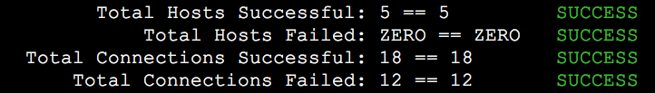

# Snowdrift: Firewall Rule Testing


## TL;DR

Turn this:

```
$ ssh fw-test-01.da.comcast.net
$ nc -vz github.comcast.cm 22 ^C
# Oops, I made a typo!
$ nc -vz gthub.comcast.com 22 ^C
# Oops, I made another typo, because I keep running these tests by hand!
```

Into this:


## Installation

```
brew tap comcast/opensource https://github.com/Comcast/homebrew-opensource.git
brew install snowdrift
```


## Details

This is unit testing for firewall rules. It will change your workflow for the better.

**Suggested usage:**
- Fork this repo so that you can put rules files you create into the `rules/` folder and save the changes to your own repo.
- Create a rules file with the network paths you need working.
- Work on firewall rules and/or iptables.
- Run Snowdrift against the rules file to check your network paths.
- Repeat the previous two steps until all tests pass.
- That's it, you're done!

This utility aims to automate that by having "rules files" which this script then procesess
and will SSH into each machine and try connecting to the target host on the specified port.

By writing and saving rules file, you now have **unit test-like ability for testing firewall changes**. 
After changes are made, you can use this script to **verify correctness of firewall operation**, as opposed
to having to SSH to different machines by hand, run netcat manually, and then run Traceroute manually
to send back to the firewall team.


## Features

- Test TCP connectivity from any host you can SSH to to any other target host
- Test UDP connectivty for DNS by making DNS queries from any host you can SSH to to any other target host
- Support for a range of hosts using the "[01-nn]" notation found in Ansible inventories.
- Support for running `traceroute` and `tcptraceroute` when a connection fails.
- Custom DNS queries can be made, with NXDOMAIN results being handled properly
- Statistics for each Rule File tested against as well as the total run
- Basic SSH connectivty to each host is checked and its state remembered, so that if there are many rules for a host you cannot SSH into, you will only see one error from the first instead of potentially dozens of errors.


## How It Works

The underlying mechanism is pretty starightforward: for each source host, this script will
SSH into that host and run netcat (if testing TCP) or dig (if testing DNS) against the
target host.  It will then report the results back to you.


## Requirements

- <a href="https://developer.github.com/v3/guides/using-ssh-agent-forwarding/">ssh-agent</a> running, with keys to all machines you want to SSH to.
- Bash
- netcat (`nc`) installed on all machines you are testing from
- `dig` installed on all machines your are testing DNS from
- SSH Agent is set up so that you can SSH into machines you are testing from without a password
- `tcptraceroute` installed on machines you want to run a TCP traceroute from


## Usage

`./snowdrift [ --filter string ] rules-file [ rules-file [ ... ] ] [ --traceroute ] [ --tcp-traceroute ] [ --traceroute-force ] [ --tcp-traceroute-force ]`

- `--filter` - Can be any string--it is filtered against the raw strings in the rules files, and only matching strings will be processed.
- `--traceroute` - When a connection fails, a traceroute to the target host will be printed
- `--tcp-traceroute` - When a connection fails, a TCP traceroute to the target host and port will be printed. Note that `tcptraceroute` is not installed by default on most distros, so you may need to install it with `yum install tcptraceroute` or similar.
- `--traceroute-force` - Always run a traceroute for each target host.
- `--tcp-traceroute-froce` - Always run a TCP traceroute for each target host and port.


## Demo

To run the demo, make sure that SSH is enabled on the machine you are testing on
and run:

`./snowdrift ./rules/demo.txt`

This will run several tests against your own machine for connectivity to 
places like Google (you can access Google, right?) and some tests which
are designed to fail.


## Sample Rules File

```
#
# Comments start with a hashmark
#

#
# Test SSH access to a specific host:
#
splunk-01.sys.comcast.net:splunk-deploy.sys.comcast.net:22

#
# Make sure Splunk can talk to our Deployment Server in port 8089.
#
# Note the "splunk-deploy/" part at the beginning--that is a tag which
# can then be filtered on.
#
splunk-deploy/splunk-01.sys.comcast.net:splunk-deploy.sys.comcast.net:8089

#
# Make sure a range of Splunk hosts talk to our Deployment Server on port 8089.
#
splunk-deploy/splunk-[01-80].sys.comcast.net:splunk-deploy.sys.comcast.net:8089

#
# Make sure Splunk host can talk to a range of target hosts over SSH.
#
splunk-01.sys.comcast.net:backups-s3-as-a-[01-20].da.comcast.net:22

#
# Test a DNS query to the default server on a host:
#
splunk-01.sys.comcast.net::dns

#
# Test a DNS query to one of our DNS servers:
# Note the use of "dns" instead of a port number.
#
splunk-01.sys.comcast.net:69.252.80.80:dns

#
# Test a DNS query to one of our DNS servers with a specific query:
# Note the extra argument after "dns" which is the query to send.
#
splunk-01.sys.comcast.net:69.252.81.81:dns:comcast.com

#
# The same, but with an NXDOMAIN:
#
splunk-01.sys.comcast.net:69.252.81.81:dns:bad-dns.comcast.com

#
# This will time out:
#
splunk-01.sys.comcast.net:10.1.2.3:dns:comcast.com

#
# The first test will fail to reach the source host, the second test will not run because state is kept:
#
10.1.2.2:69.252.80.80:dns
10.1.2.2:69.252.80.81:dns:cnn.com

```


## Netcat Versions Supported

The funny thing about Netcat is that there are so many versions to choose from!
Some distros even have multiple versions of Netcat available.  Fantastic!
Below is a list of Linux distros and their versions of NetCat that have been
tested, a reported with the `./bin/audit-netcat-versions` script:

- Alpine 3.6: `BusyBox v1.26.2 (2018-05-30 13:51:20 GMT) multi-call binary.`
- Alpine 3.6: `OpenBSD netcat (Debian patchlevel 1.130)`
- Centos 8: `Ncat 7.70 ( https://nmap.org/ncat )`
- Ubuntu 19.10: `[v1.10-41.1]`
- Ubuntu 19.10: `OpenBSD netcat (Debian patchlevel 1.203-1)`

If you don't see your favorite distro on the list, <a href="https://github.com/Comcast/snowdrift/issues">do let me know</a>!


## Testing

Run `./test.sh`.  It will spin up multiple Docker containers with Docker Compose
and run a series of tests.  The values will then be checked expect their expected
values and results will be output indicating success or failure.

Output from a successful testing run:



Tests can be found in <a href="files/snowdrift-tests.txt">files/snowdrift-tests.txt</a>.


## Debugging

The following environment variables can be set to output debugging info:

- `DEBUG_CMD` - Print out the command sent to SSH
- `DEBUG_SSH_CHECK` - Print out the logic used to check whether we can SSH into a host or not
- `DEBUG_CMD_OUTPUT` - Print the raw output from the SSH command


## Development

- To build and get into the `testing` container:
  - `./bin/dev-testing`
- To build and start the `source` container`
  - `./bin/dev-source`


## Credits

- <a href="https://github.com/steinbrueckri">Richard Steinbrück</a> - Added spport for port ranges.


## TODO

[Our TODO List](TODO.md)


