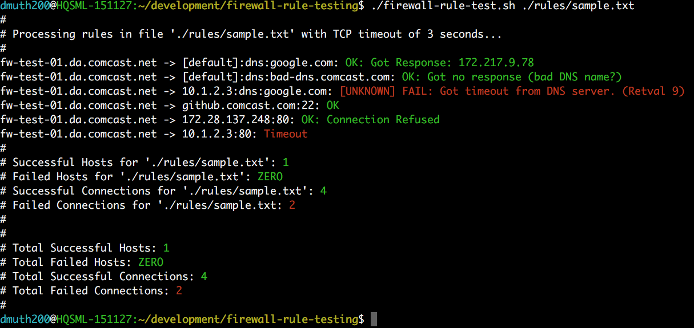

# Firewall Rule Testing

TL;DR This is unit testing for firewall rules. It will change your workflow for the better.

In a firewall heavy environment, being able to test your firewall rules is essential.  
This utility aims to automate that by having "rules files" which this script then procesess
and will SSH into each machine and try connecting to the target host.

By writing and saving rules file, you now have **unit test-like ability for testing firewall changes**. 
After changes are made, you can use this script to **verify correctness of firewall operation**, as opposed
to having to SSH to different machines by hand, run netcat manually, and then run Traceroute manually
to send back to the firewall team.


## Features

- Test TCP connectivity from any host you can SSH to to any other target host
- Test UDP connectivty for DNS by making DNS queries from any host you can SSH to to any other target host
- Support for a range of hosts using the "[01-nn]" notation found in Ansible inventories.
- Support for running `traceroute` and `tcptraceroute` when a connection fails.
- Custom DNS queries can be made, with NXDOMAIN results being handled properly
- Statistics for each Rule File tested against as well as the total run
- Basic SSH connectivty to each host is checked and its state remembered, so that if there are many rules for a host you cannot SSH into, you will only see one error from the first instead of potentially dozens of errors.


## How It Works

The underlying mechanism is pretty starightforward: for each source host, this script will
SSH into that host and run netcat (if testing TCP) or dig (if testing DNS) against the
target host.  It will then report the results back to you.


## Requirements

- <a href="https://developer.github.com/v3/guides/using-ssh-agent-forwarding/">ssh-agent</a> running, with keys to all machines you want to SSH to.
- Bash
- netcat (`nc`) installed on all machines you are testing from
- `dig` installed on all machines your are testing DNS from
- SSH Agent is set up so that you can SSH into machines you are testing from without a password
- `tcptraceroute` installed on machines you want to run a TCP traceroute from


## Usage

`./firewall-rule-test [ --filter string ] rules-file [ rules-file [ ... ] ] [ --traceroute ] [ --tcp-traceroute ] [ --traceroute-force ] [ --tcp-traceroute-force ]`

- `--filter` - Can be any string--it is filtered against the raw strings in the rules files, and only matching strings will be processed.
- `--traceroute` - When a connection fails, a traceroute to the target host will be printed
- `--tcp-traceroute` - When a connection fails, a TCP traceroute to the target host and port will be printed. Note that `tcptraceroute` is not installed by default on most distros, so you may need to install it with `yum install tcptraceroute` or similar.
- `--traceroute-force` - Always run a traceroute for each target host.
- `--tcp-traceroute-froce` - Always run a TCP traceroute for each target host and port.


## Demo

To run the demo, make sure that SSH is enabled on the machine you are testing on
and run:

`./firewall-rule-test ./rules/demo.txt`

This will run several tests against your own machine for connectivity to 
places like Google (you can access Google, right?) and some tests which
are designed to fail.


## Screenshots

From a sample run:




## Rules Files

Comments begin with `#`.

Empty lines are acceptable.


### Rules Format (TCP)

This is the format for testing an arbitrary TCP port:

`[tag/]$source_host:$dest_host:$tcp_port`

This script will SSH to the source host, then use netcat to check the TCP port of the destination host.
This script will report whether the attempt succeeded, timed out, or whether the connection 
was refused.  In the case of a refused connection, that is still treated as a "success", because
that means the network path to the target machine is very likely fine, it's just that the
service isn't running on said machine (or iptables is blocking it).

`tag` is used to tag a rule or series of rules to make filtering easier.


### Rules Format (DNS)

The syntax for testing DNS servers is similar:

`[tag/]$source_host:[$dns_server]:dns:[$hostname]`

`$dns_server` should be the hostname or IP of a DNS server to test.  If left blank, the
default server(s) in `/etc/resolv.conf` will be used instead. 

`dns` is a string that is used instead of a TCP port number.

`$hostname` is the DNS query to send.  It defaults to `google.com` if not specified.

The script will report on whether the DNS query was successful.  If a DNS query results in NXDOMAIN
it is still treated as successful because that means there is network connectivity to the DNS server.

`tag` is used to tag a rule or series of rules to make filtering easier.


### Sample Rules

Test SSH access to a specific host:

```
splunk-01.sys.comcast.net:splunk-deploy.sys.comcast.net:22
```

Make sure Splunk can talk to our target host:

```
splunk-01.sys.comcast.net:splunk-deploy.sys.comcast.net:8089
```

Make sure a **range of Splunk hosts** can talk to our target host:

```
splunk-[01-80].sys.comcast.net:splunk-deploy.sys.comcast.net:8089
```

Make sure Splunk host can talk to **a range of target hosts**:

```
splunk-01.sys.comcast.net:backups-s3-as-a-[01-20].da.comcast.net:8089
```

Test a DNS query to the default server on a host:

```
splunk-01.sys.comcast.net::dns
```

Test a DNS query to one of our DNS servers:

```
splunk-01.sys.comcast.net:69.252.80.80:dns
```

Test a DNS query to one of our DNS servers with a specific query:

```
splunk-01.sys.comcast.net:69.252.81.81:dns:comcast.com
```

The same, but with an NXDOMAIN:

```
splunk-01.sys.comcast.net:69.252.81.81:dns:bad-dns.comcast.com
```

This will time out:

```
splunk-01.sys.comcast.net:10.1.2.3:dns:comcast.com
```

The first test will fail to reach the source host, the second test will not run because state is kept:

```
10.1.2.2:69.252.80.80:dns
10.1.2.2:69.252.80.81:dns:cnn.com
```


## Debugging

The following environment variables can be set to output debugging info:

- `DEBUG_CMD` - Print out the command sent to SSH
- `DEBUG_SSH_CHECK` - Print out the logic used to check whether we can SSH into a host or not
- `DEBUG_CMD_OUTPUT` - Print the raw output from the SSH command


## Testing

Testing can be done via docker, simply cd into the `testing/` directory and
run the script `go.sh`.  This will spin up some docker containers, and test
the app from inside them.


## TODO

- Come up with a way to test UDP port 123 for NTP
- Add support for testing that paths **do** time out, and mark them as "success"
   - Maybe change stats variables from success/fail to pass/fail


